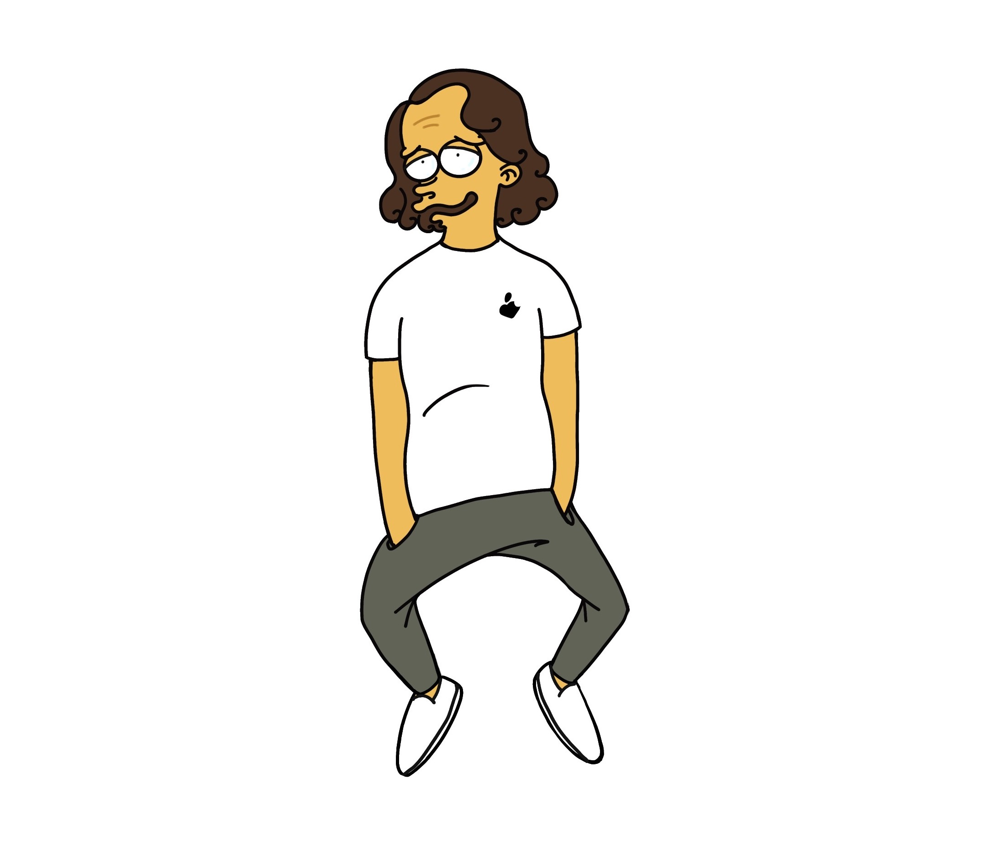

{:.lead srcset="/assets/img/about/cartoon-marco.jpg 1920w, /assets/img/about/cartoon-marco@0,5x.jpg 960w, /assets/img/about/cartoon-marco@0,25x.jpg 480w" data-width="1920" data-height="1080"}
Artwork by my partner. After months of COVID-19 quarantine this is how she sees me - not my best look.
{:.figure}

*[FLIP]: First-Last-Invert-Play. A coding technique to achieve performant page transition animations.
